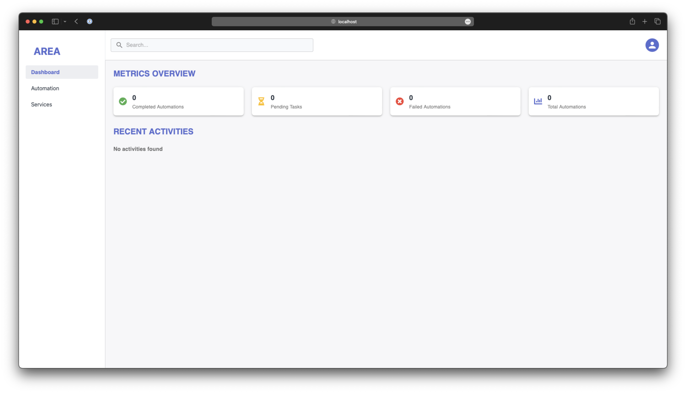
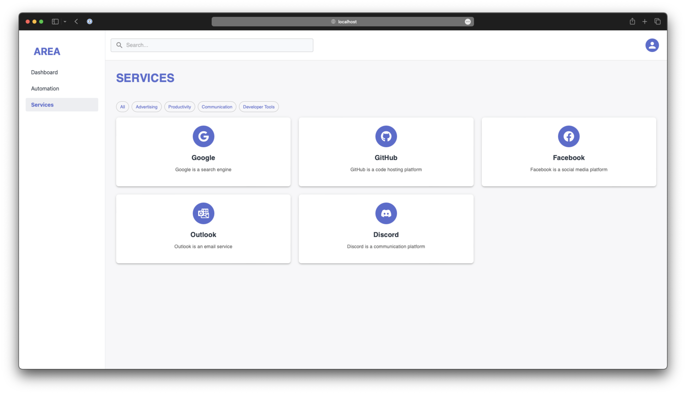
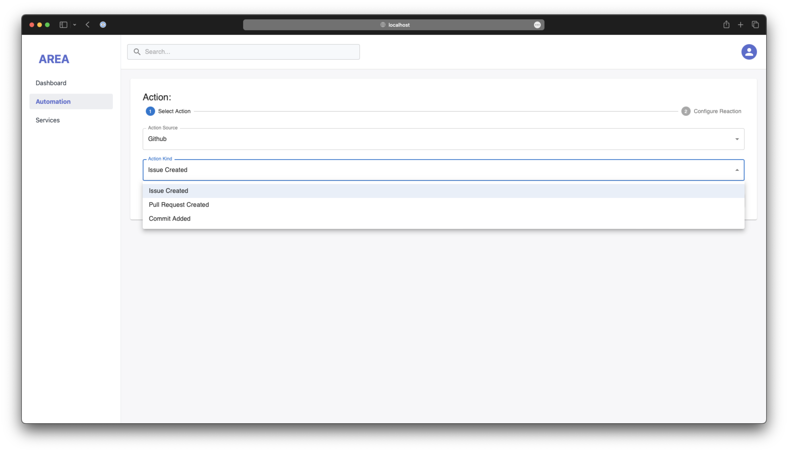
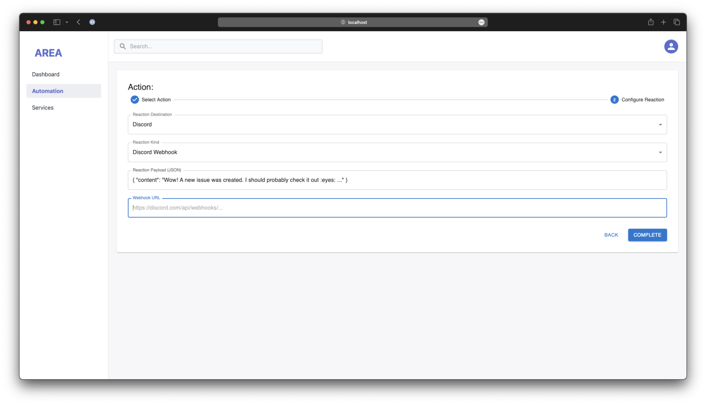
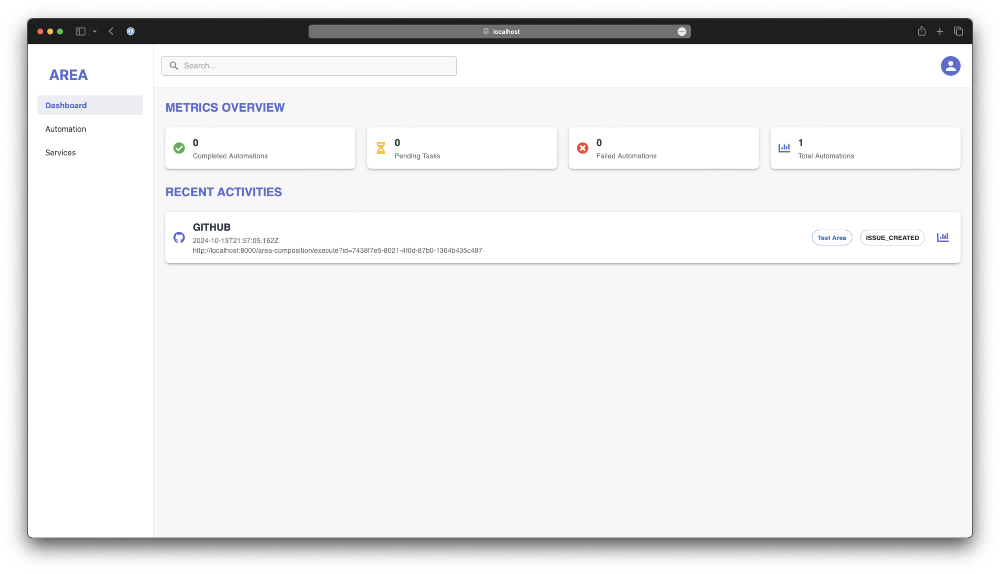
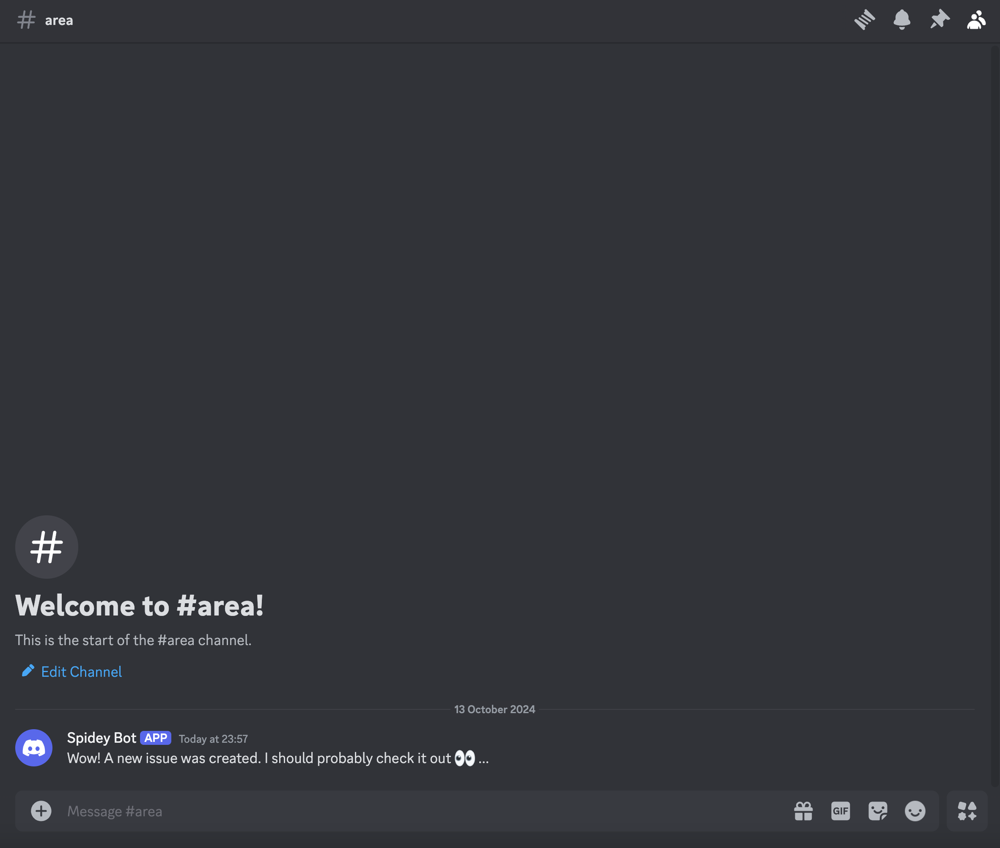

# AREA

The aim of this project is to create a platform that allows users to create
automations between different services. The user can create a service that
triggers an action when a specific event occurs.

## Setup

1. Clone the repository and checkout the `staging` branch.

```sh
git clone https://github.com/EpitechPromo2027/B-DEV-500-BAR-5-1-area-tim.lundstedt/ .
git fetch origin
git checkout staging
git pull origin staging
```

2. Fill in the `oauth2` configuration files.

```sh
cp server/service-management/.env.example server/service-management/.env
vim server/service-management/.env

cp server/user-management/.env.example server/user-management/.env
vim server/user-management/.env

cp server/action/.env.example server/action/.env
vim server/action/.env
```
<!-- EXIST AND REOPEN IT PLEASE -->
3. Fill in the `frontend` configuration file.

```sh
cp www/.env.example www/.env
```

4. Create a tunnel using
   [`cloudflared`](https://github.com/cloudflare/cloudflared).

```sh
cloudflared tunnel --url localhost:8000

2024-11-05T14:53:02Z INF +--------------------------------------------------------------------------------------------+
2024-11-05T14:53:02Z INF |  Your quick Tunnel has been created! Visit it at (it may take some time to be reachable):  |
2024-11-05T14:53:02Z INF |  https://your-unique-url.trycloudflare.com                                                 |
2024-11-05T14:53:02Z INF +--------------------------------------------------------------------------------------------+
```

5. Initialize the server microservices.

```sh
PUBLIC_URL=https://your-unique-url.trycloudflare.com docker compose -f server/deployment/docker-compose.yml up --build -d
```

6. Initialize the client.

```sh
docker compose -f www/docker-compose.yml up --build -d
```

7. Access the client at `http://localhost:5173`.

```sh
open http://localhost:5173
```

## Usage

1. In the main page, click on the `Get started for free` button.


2. Fill in the form with your information. You can also use `GitHub` and
   `Google` to authenticate.


3. Once you have registered, you will be redirected to the main page.



1. To add a new service, you first have to connect your account. For instance,
   you can connect your `GitHub` account. Head to `Services` on the left menu.



5. Click on the `GitHUb` icon, and follow the instructions. Once you have
   connected your account, you will be redirected to the main page. You can also
   filter the services by category, such as `Productivity`, `Developer Tools`
   and the like.

6. Now, you can add a new service. Click on the `Automation` button on left
   menu.

7. The first step is to fill the `Action` information. This will be the trigger
   for the service. For our example, we will send a Discord Message when a new
   GitHub issue is created.



8. Now, you have to fill the `Reaction` information. This will be the action
   that will be executed when the trigger is activated.

> [!NOTE]
> As you may have noticed, the _payload_ field is JSON. This is to ensure that
> each reaction can be customized to your needs. In this case, we will send a
> message to a Discord channel. Due to this customization, you can send any
> message you want, including Discord specific features such as embeds.



9. Once you have filled the information, click on the `Complete` button. You
   will be redirected to the main page. You can see the service you have
   created. There is a URL that you will need to copy and paste in the GitHub
   repository you want to monitor.

> [!TIP]
> You can also test the service by clicking on the `Test Area` button. This will
> simulate the trigger and reaction.



10. When a new issue is created on the GitHub repository, you will receive a
    message on the Discord channel you have configured.


